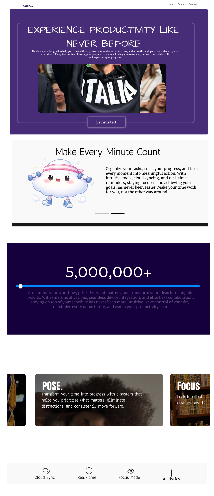

# Willow 

## Functionality

- **Task Management**: Create, edit, and organize your tasks easily.  
- **Cloud Sync**: Access your tasks across all devices in real time.  
- **Real-Time Reminders**: Get notifications for deadlines and recurring tasks.  
- **Focus Mode**: Eliminate distractions and work efficiently with a Pomodoro-style timer.  
- **Analytics Dashboard**: Track your productivity, progress, and streaks.  
- **Habit Streaks**: Build consistent habits with gamified streak tracking.  

## Technologies Used

- **Frontend:** HTML, CSS, JavaScript (Vanilla JS)  
- **Backend (optional/future):** Node.js / Express.js  
- **Cloud Services:** AWS (for real-time syncing and authentication)  
- **Version Control:** Git & GitHub  
- **Design:** Figma (for UI/UX prototypes)

## **Core Features**

- **Task Management:** Add, edit, and organize tasks effortlessly.  
- **Cloud Storage:** Upload images to tasks and access them across all devices.  
- **Focus Mode:** Block distractions and stay in the zone.  
- **Analytics Dashboard:** Track productivity, streaks, and progress.  
- **Leaderboard:** Compete with other users for consistency and achievements.  
- **Spotify Integration:** Play your favorite music while working for optimal focus.

---

## **How to Use Willow**

1. **Visit the Landing Page**  
   - Open the Willow landing page and click **“Get Started”**.

2. **Sign Up or Log In**  
   - Create a new account or log in to enable cloud sync, leaderboard tracking, and Spotify integration.

3. **Add and Organize Tasks**  
   - Click **“Add Task”** and optionally attach images from your device.  
   - Assign tags, priorities, or due dates to your tasks.

4. **Track Your Progress**  
   - Check your **Analytics Dashboard** for completed tasks, streaks, and productivity insights.  
   - Your consistency automatically updates your **Leaderboard ranking**.

5. **Focus Mode & Spotify**  
   - Activate **Focus Mode** to reduce distractions.  
   - Use Spotify integration to play music while working.

6. **Leaderboard**  
   - Compete with other users based on task consistency.  
   - Watch your rank rise as you maintain streaks.

7. **Cloud Uploads**  
   - Upload images or files to your tasks for reference.  
   - All media is synced securely in the cloud.

   ## Try Willow Today: [🌿 Launch Willow](https://your-live-link.com)